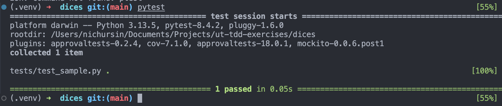
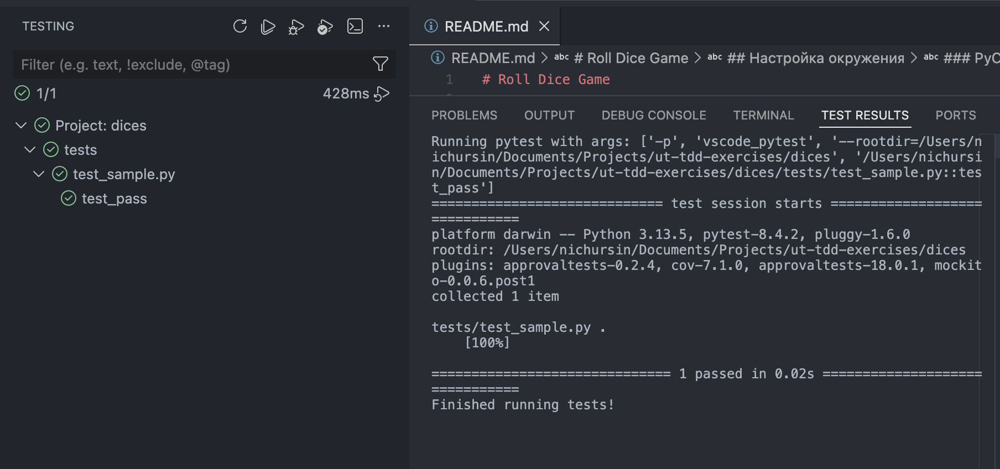

# Roll Dice Game

## ВАЖНО!
При первом знакомстве с кодом через тесты, старайтесь покрыть не самую простую часть функционала, а самую важную, чтобы лучше познакомиться с кодом упражнения.

## Настройка окружения

Вы можете использовать ваше текущее рабочее окружение, если проект открывается в нём и у вас получается запустить
тесты.
Если рабочего окружения нет или оно не подходит, то используйте инструкцию по настройке.
В рамках тренинга мы собираемся использовать VSCode, но вы сможете выполнять упражнения в PyCharm, если это вам удобно.

### Требования

- python3 (3.10 - 3.14)

### Подготовка

#### Для Mac

Если у вас OS X и вы собираетесь использовать VSCode, то надо знать, что стандартное расширение ms-python.python не
поддерживает встроенный интерпретатор.

**Если у вас python3 из любого другого источника (conda, brew, pyenv), то можно пропустить этот пункт**. Если нет, то
вот способ поставить.

```bash
# для OS X, если у вас установлен только встроенный интерпретатор
brew install pyenv
pyenv install 3.14
pyenv global 3.14
```

#### Для всех

```bash
cd new-ut-tdd/Python
python3 -m venv .venv
source .venv/bin/activate
cp .assets/pip.conf .venv/pip.conf # на случай, если у вас по умолчанию стоит рабочий реестр пакетов
pip install -r requirements.txt
pytest tests
```



### VSCode

Надо поставить расширения. При первом открытии репозитория, VSCode должен предложить это сделать. Можно сделать вручную.

- ms-python.python
- ms-python.pylint
- ms-python.autopep8

После запуска тестов, окружение должно выглядеть так. Часть тестов могуть быть красными, это нормально.



### PyCharm Community Edition

Иногда pycharm может не найти виртуальное окружение, тогда его можно добавить вручную в настройках проекта.
